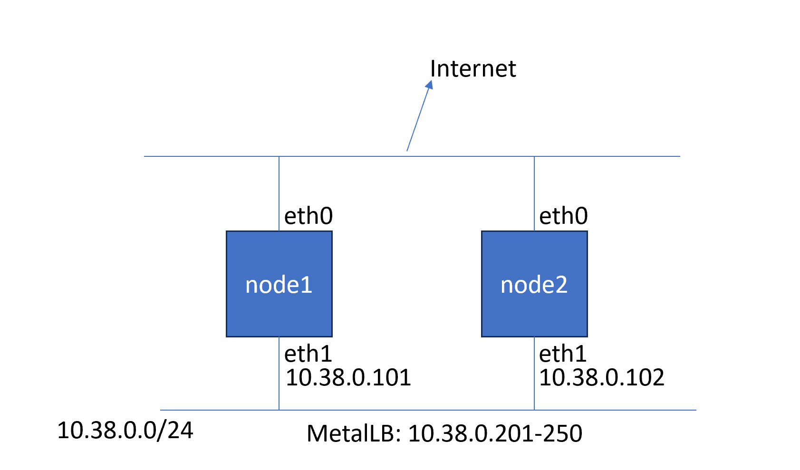
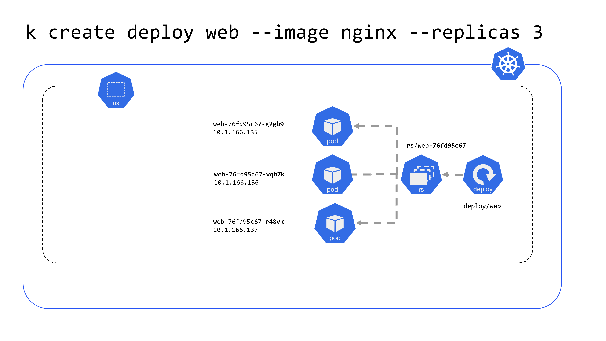
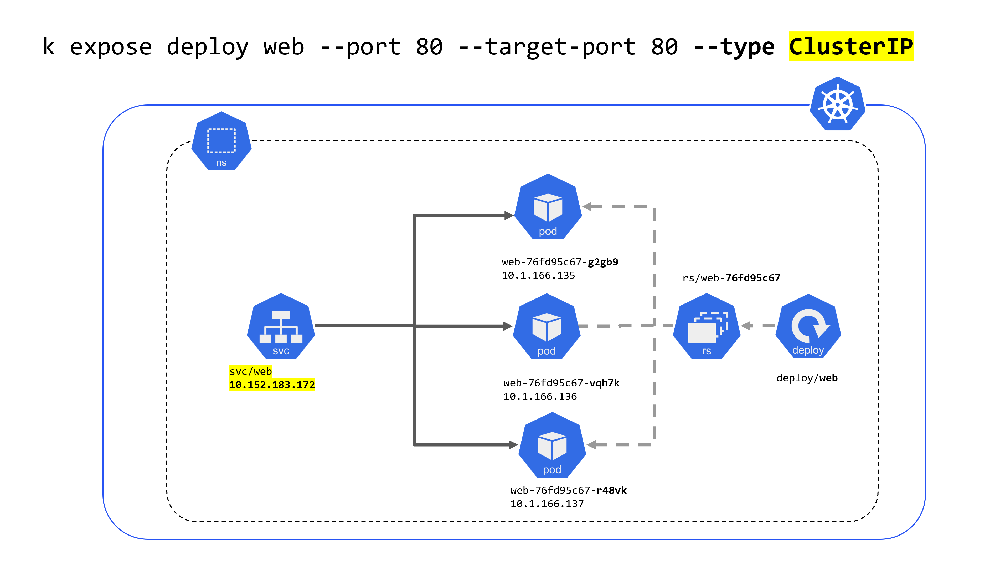
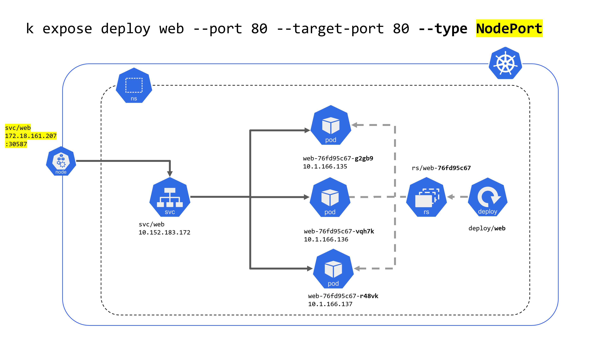
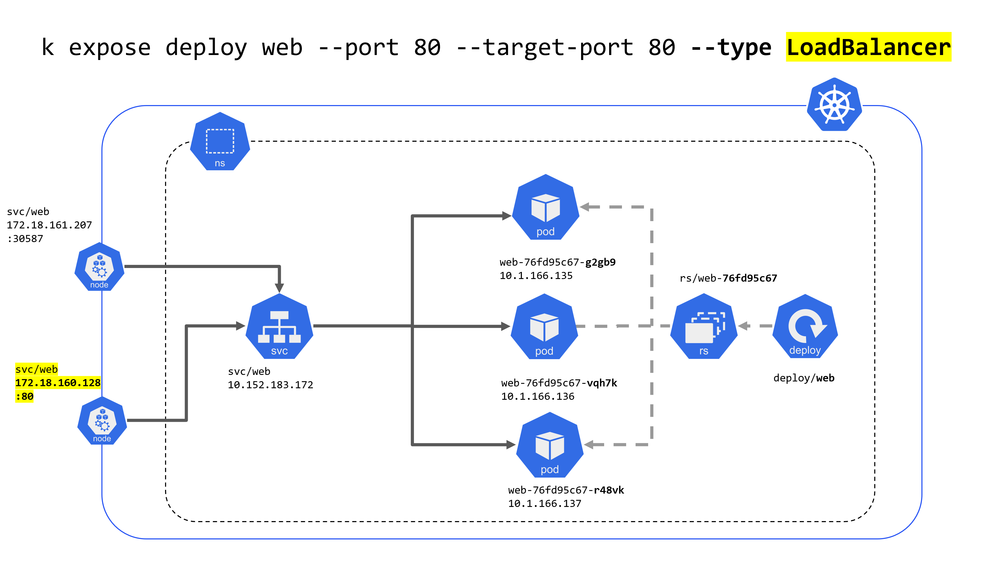
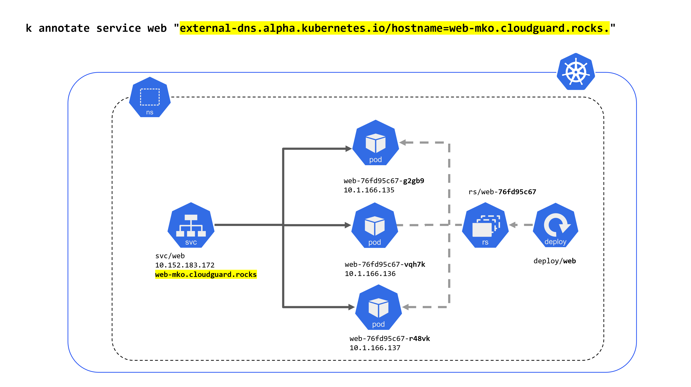
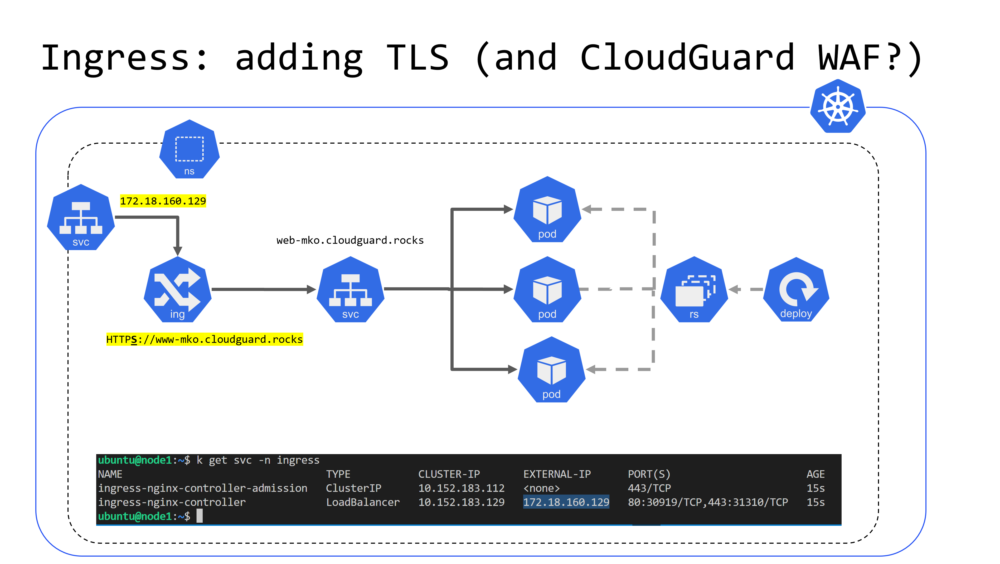

# Publishing web apps with effortless DNS and TLS - local MicroK8s cluster

We are using [Multipass](https://multipass.run/) to launch Ubuntu LTS VMs on Windows 10 Hyper-V. We will install MicroK8s on the VMs and deploy a simple web app. We will use MetalLB for LoadBalancer service type, External-DNS for DNS records, Cert-Manager for TLS certificates, and NGINX Ingress Controller for Ingress resources.

### Preparations

* Install [Multipass](https://multipass.run/) on Windows 10 with Hyper-V enabled - more info [here](https://multipass.run/docs/installing-on-windows)

* Diskspace - VMs will take some space, make sure you have enough; often default C: drive is not the best choice. [doc](https://multipass.run/docs/configure-multipass-storage#heading--windows)

### Lab VMs



```shell
# powershell

# check free space on C: and other drives
Get-Volume

# check current Multipass data location
Get-ItemPropertyValue -Path "HKLM:System\CurrentControlSet\Control\Session Manager\Environment" -Name MULTIPASS_STORAGE

# to change default drive for multipass
# admin powershell (windows is missing sudo; MS launching it for Win 11)
Start-Process pwsh -verb runas
Start-Process powershell -verb runas

mkdir d:/multipass

# reference doc https://multipass.run/docs/configure-multipass-storage#heading--windows
Stop-Service Multipass
Set-ItemProperty -Path "HKLM:System\CurrentControlSet\Control\Session Manager\Environment" -Name MULTIPASS_STORAGE -Value "d:/multipass"
Start-Service Multipass

# might need to copy exiting cert to new location - 
ls D:\multipass\data\authenticated-certs\
Restart-Service Multipass

# multipass should work withor complaints about authentication
```

### Networking - dedicated private subnet for VMs with static private IP addresses

```shell
# admin powershell

# add dedicated Hyper-V virtual switch
New-VMSwitch -SwitchName "multipass" -SwitchType Internal
# get the interface index
Get-NetAdapter | Select-Object -Property Name, InterfaceDescription, ifIndex
# look for "vEthernet (multipass)"
Get-NetAdapter | ? Name -eq "vEthernet (multipass)" | % ifIndex
$multipassIfIndex = Get-NetAdapter | ? Name -eq "vEthernet (multipass)" | % ifIndex

# choosing address = e.g. 10.38.0.0/24
# you might have VPN connected - check if VPN contains your subnet

# hopefully free
get-netroute | ? { $_.DestinationPrefix.StartsWith("10.38") }
# might be used on VPN
get-netroute | ? { $_.DestinationPrefix.StartsWith("192.168.0") }

# use free address for our new segment
New-NetIPAddress -IPAddress 10.38.0.0 -PrefixLength 24 -InterfaceIndex $multipassIfIndex

# check if it's there
Get-NetIPAddress -InterfaceAlias "vEthernet (multipass)" | Select-Object IPAddress, PrefixLength
```

### Launch first cluster node with cloud-init

```shell
# create VM - review RAM and disk size
multipass launch -v -n node1 --cloud-init cloud-init-node1.yml -m 6G -d 20G -c 4 --network name=multipass,mode=manual,mac=52:54:00:f1:94:fa
# some checks 
multipass exec node1 -- sudo tail -f /var/log/cloud-init-output.log # did cloud-init work well?
multipass exec node1 -- microk8s.kubectl get po -A --watch # monitors pods in all ns
multipass exec node1 -- microk8s status -w # will wait in case cluster is not ready

# enter VM command line
multipass shell node1

# check if we have static IP address
ip a show dev eth1
# nodes - looking for soon to joining node2?
k get no -o wide --watch

# create second node - ONCE node1 is ready
# BACK IN WINDOWS POWERSHELL

# IPs and names for VMs
gc C:\WINDOWS\System32\drivers\etc\hosts.ics | sls node
# 172.25.197.28 node1.mshome.net # 2024 4 3 10 10 37 52 955
# 172.25.197.213 node2.mshome.net # 2024 4 3 10 10 44 6 904
ping node1.mshome.net
ping node2.mshome.net

# SSH keys for multipass - admin pwsh
Start-Process pwsh -verb runas
gci -rec d:/multipass | % FullName | sls ssh
gc D:/multipass/data/ssh-keys/id_rsa
ssh -i D:/multipass/data/ssh-keys/id_rsa ubuntu@node1.mshome.net
ssh -i D:/multipass/data/ssh-keys/id_rsa ubuntu@172.25.197.28
ssh -i D:/multipass/data/ssh-keys/id_rsa ubuntu@10.38.0.101 # node1
ssh -i D:/multipass/data/ssh-keys/id_rsa ubuntu@10.38.0.102 # node2

# multipassD debug
Stop-Service multipassd
# and then
 multipassd.exe -V trace --logger stderr

# create second node - ONCE node1 is ready

multipass launch -v -n node2 --cloud-init cloud-init-node2.yml -m 4G -d 20G -c 4 --network name=multipass,mode=manual,mac=52:54:00:f1:94:fb
# enter VM command line
multipass shell node2
```

### Expose Web app using MetalLB provided IP

Back in node1 shell:

```shell
# from node1
multipass shell node1

# wait for cluster to get ready
microk8s status -w

# check what we have got
k get nodes -o wide
k get pods -o wide -A

# try it out

# make web server with 3 replicas
k create deploy web --image nginx --replicas 3
k get pods -l app=web -o wide
```



```shell
# expose it externally on IP provided by MetalLB
k expose deploy web --port 80 --target-port 80 --type ClusterIP

# got fixed IP representing pods in deployment: CLUSTER-IP 10.152.183.172
k get svc web
# NAME   TYPE        CLUSTER-IP       EXTERNAL-IP   PORT(S)   AGE
# web    ClusterIP   10.152.183.172   <none>        80/TCP    2s

# this IP is >usually< not accessible outside of the cluster (therefore called ClusterIP)
curl -vvv "http://$(k get svc/web -o json | jq -r '.spec.clusterIP')"
WEBCIP=$(kubectl get svc/web -o json | jq -r '.spec.clusterIP')
# but enough inside the cluster
k run -it --rm --restart=Never --image=nginx client --  curl -vvv http://$WEBCIP
# and it even has DNS name
k run -it --rm --restart=Never --image=nginx client2 --  curl -vvv http://web.default.svc.cluster.local
k run -it --rm --restart=Never --image=nginx client3 --  curl -vvv web.default.svc.cluster.local 2>&1 | grep 'Connected to'
```



```shell
# lets expose service on Node port - PORT(S) 30587 -> 80/TCP
kubectl patch svc web -p '{"spec": {"type": "NodePort"}}'
# we have hot NodePort now
k get svc web
# NAME   TYPE       CLUSTER-IP       EXTERNAL-IP   PORT(S)        AGE
# web    NodePort   10.152.183.172   <none>        80:30587/TCP   26s

# connect to node's high port representing svc/web
k get nodes -o json | jq -r '.items[0].status.addresses[0].address' # node IP
k get svc web -o json | jq -r '.spec.ports[0].nodePort' # high port of svc/web
echo curl -vvv "http://$(k get nodes -o json | jq -r '.items[0].status.addresses[0].address'):$(k get svc web -o json | jq -r '.spec.ports[0].nodePort')"
curl -vvv "http://$(k get nodes -o json | jq -r '.items[0].status.addresses[0].address'):$(k get svc web -o json | jq -r '.spec.ports[0].nodePort')"
```



```shell
# lets expose service on LoadBalancer (MetalLB IP address)
kubectl patch svc web -p '{"spec": {"type": "LoadBalancer"}}'

# look for external IP: 172.18.160.128
k get svc web

# NAME   TYPE           CLUSTER-IP       EXTERNAL-IP      PORT(S)        AGE
# web    LoadBalancer   10.152.183.172   172.18.160.128   80:30587/TCP   16m

WEBIP=$(k get svc web -o jsonpath='{.status.loadBalancer.ingress[0].ip}')
echo "Access http://$WEBIP on host machine browser"
```




```shell
# mark each pod with hostname
for P in $(k get po -l app=web -o name); do k exec -it $P -- find /usr/share -name index.html; done
for P in $(k get po -l app=web -o name); do k exec -it $P -- bash -c 'echo $HOSTNAME | tee /usr/share/nginx/html/index.html'; done

# visit through svc (lb) - see how many times per each pod
for I in $(seq 1 50); do curl -s http://$WEBIP; done | sort | uniq -c | sort -nr
```

### Install K9s using Arkade (ark)

`k9s` is a terminal UI to interact with Kubernetes clusters. Arkade (aka `ark`) is a CLI that makes installation of cloud native tools easier.

```shell

# install k9s tui
ark get k9s
sudo mv /home/ubuntu/.arkade/bin/k9s /usr/local/bin/

# it depends on kube config
mkdir ~/.kube; sudo microk8s config > ~/.kube/config
chmod o= ~/.kube/config
chmod g= ~/.kube/config

k9s 
```

### External DNS setup

Lets use [External-DNS](https://github.com/kubernetes-sigs/external-dns) to create DNS records for our web services automatically.

Note: `--txt-owner-id` 

```shell
# create namespace for external-dns
k create ns external-dns

# use real Cloudflare API token and e-mail - ask instructor
export EMAIL=someone@example.com
export CFTOKEN='bring-your-own-token'

# store as secret
kubectl -n external-dns create secret generic  cf-dns-setup --from-literal=CF_API_EMAIL=$EMAIL --from-literal=CF_API_TOKEN=$CFTOKEN

cat << 'EOF' | k apply -n external-dns -f -
apiVersion: v1
kind: ServiceAccount
metadata:
  name: external-dns
---
apiVersion: rbac.authorization.k8s.io/v1
kind: ClusterRole
metadata:
  name: external-dns
rules:
- apiGroups: [""]
  resources: ["services","endpoints","pods"]
  verbs: ["get","watch","list"]
- apiGroups: ["extensions","networking.k8s.io"]
  resources: ["ingresses"]
  verbs: ["get","watch","list"]
- apiGroups: [""]
  resources: ["nodes"]
  verbs: ["list", "watch"]
---
apiVersion: rbac.authorization.k8s.io/v1
kind: ClusterRoleBinding
metadata:
  name: external-dns-viewer
roleRef:
  apiGroup: rbac.authorization.k8s.io
  kind: ClusterRole
  name: external-dns
subjects:
- kind: ServiceAccount
  name: external-dns
  namespace: default
---
apiVersion: apps/v1
kind: Deployment
metadata:
  name: external-dns
spec:
  strategy:
    type: Recreate
  selector:
    matchLabels:
      app: external-dns
  template:
    metadata:
      labels:
        app: external-dns
    spec:
      serviceAccountName: external-dns
      containers:
      - name: external-dns
        image: registry.k8s.io/external-dns/external-dns:v0.14.0
        args:
        - --source=service 
        - --source=ingress 
        - --domain-filter=cloudguard.rocks 
        - --provider=cloudflare
        - --txt-owner-id=mko.cloudguard-rocks # use your own!
        env:
        - name: CF_API_TOKEN
          valueFrom:
             secretKeyRef:
                name: cf-dns-setup
                key: CF_API_TOKEN
        - name: CF_API_EMAIL
          valueFrom:
             secretKeyRef:
                name: cf-dns-setup
                key: CF_API_EMAIL
---
EOF

# check what was deployed for you
k get all -n external-dns

# create A record for web service

# will use existing web service
k get svc web

# unique id - e.g. mko for Martin Koldovsky to assure uniqueness of resources like DNS records
export MYID=mko # use your own!

# DNS record is created based on service or ingress annotations
k annotate service web "external-dns.alpha.kubernetes.io/hostname=web-${MYID}.cloudguard.rocks."
k annotate service web "external-dns.alpha.kubernetes.io/ttl=60" 

# review annotations
k describe svc web # check annotations

# check DNS record creation process
k logs -f -n external-dns deploy/external-dns

# once record is created
dig +short @1.1.1.1 web-${MYID}.cloudguard.rocks

# now service is reacheble also by DNS name (not only IP)
echo "Visit http://web-${MYID}.cloudguard.rocks from host machine browser"

# CLI test
curl -vvv http://web-${MYID}.cloudguard.rocks 2>&1 
curl -vvv http://web-${MYID}.cloudguard.rocks 2>&1 | grep 'web server is'

# summary we have DNS record for web service, 
# but we would love to have also HTTPS access with valid certificate
```




### Cert manager cluster issuer with DNS-01 validator

Lets use Cert-Manager to get TLS certificates for our web services using Lets Encrypt. We provide Cloudflare API token to Cert-Manager to create DNS records for DNS-01 challenge.

```shell

# use real Cloudflare API token and e-mail - ask instructor
export EMAIL=someone@example.com
export CFTOKEN='bring-your-own-token'

# store as secret
k -n cert-manager create secret generic  cloudflare-api-token-secret --from-literal=api-token=$CFTOKEN

# make cluster issuer for lets-encrypt with DNS-01 challenge
cat << 'EOF' | sed "s/someone@example.com/$EMAIL/" | k apply -f -
apiVersion: cert-manager.io/v1
kind: ClusterIssuer
metadata:
 name: lets-encrypt
 namespace: cert-manager
spec:
 acme:
   email: someone@example.com
   server: https://acme-v02.api.letsencrypt.org/directory
   privateKeySecretRef:
     # Secret resource that will be used to store the account's private key.
     name: lets-encrypt-priviate-key
   # Add a single challenge solver, DNS01 using cloudflare
   solvers:
    - dns01:
        cloudflare:
          email: someone@example.com
          apiTokenSecretRef:
            name: cloudflare-api-token-secret
            key: api-token
EOF
```

### Ingress setup

Once cert-manager is ready to monitor ingress annotations for TLS certificates, we can create Ingress resources for our web services.

```shell
# will replace default MicroK8s ingress controller with NGINX
microk8s disable ingress

# install NGINX Ingress Controller - kubectl binary required
ark get kubectl
ark get helm
echo 'export PATH=$PATH:/home/ubuntu/.arkade/bin' >> ~/.bashrc
source ~/.bashrc

# save kube config!
sudo mkdir -p ~/.kube;
sudo microk8s config > ~/.kube/config
chmod o= ~/.kube/config
chmod g= ~/.kube/config

# install ingress-nginx using Arkade tool into ingress namespace
# notice that we are using "public" ingress class
ark install ingress-nginx --namespace ingress --set controller.ingressClassResource.name=public

# verify external IP of ingress controller
k get svc -n ingress

# verify existing web service that we are about to publish
k get svc web
```



```shell
# verify existing web service that we are about to publish
k get svc web

# unique id - e.g. mko for Martin Koldovsky to assure uniqueness of resources like DNS records
export MYID=mko # use your own!
# direct service access was:
dig +short @1.1.1.1 web-${MYID}.cloudguard.rocks

# create ingress resource for web service
# will publish on https://www-${MYID}.cloudguard.rocks

cat << EOF |  sed "s/www.cloudguard.rocks/www-$MYID.cloudguard.rocks/" | k apply -f -
apiVersion: networking.k8s.io/v1
kind: Ingress
metadata:
 name: web
 annotations:
   cert-manager.io/cluster-issuer: lets-encrypt
   external-dns.alpha.kubernetes.io/hostname: www-${MYID}.cloudguard.rocks.
   external-dns.alpha.kubernetes.io/ttl: "60"
spec:
 ingressClassName: public
 tls:
 - hosts:
   - www.cloudguard.rocks
   secretName: web-ingress-tls
 rules:
 - host: www.cloudguard.rocks
   http:
     paths:
     - backend:
         service:
           name: web
           port:
             number: 80
       path: /
       pathType: Prefix
EOF

# check what was created
k describe ing/web

# was DNS A record created?
dig +short @1.1.1.1 www-${MYID}.cloudguard.rocks
watch -d "dig +short @1.1.1.1 www-${MYID}.cloudguard.rocks"

# was certificate provided? ready state?
k get certificate
watch -d kubectl get certificate

# test it out
echo "Visit https://www-${MYID}.cloudguard.rocks from host machine browser"

# CLI test
sudo resolvectl flush-caches
curl -vvv https://www-${MYID}.cloudguard.rocks 2>&1 
# see cert subject and issuer
curl -vvv https://www-${MYID}.cloudguard.rocks 2>&1 | grep CN

# review process of TLS cert creation (DNS-01 challenge)
k logs -f -n cert-manager deploy/cert-manager
# and DNS updates here
k logs -f -n external-dns deploy/external-dns
```


### CoreDNS custom forwarders
https://devops.cisel.ch/customizing-coredns-forwarders-on-kubernetes

### Expose existing service by patching to type LoadBalancer

```shell
ark install argocd
ark info argocd
kubectl patch svc argocd-server  -n argocd -p '{"spec": {"type": "LoadBalancer"}}'
k get svc -n argocd
# now it has external IP...

# Get the password
PASS=$(kubectl get secret argocd-initial-admin-secret \
  -n argocd \
  -o jsonpath="{.data.password}" | base64 -d)
echo $PASS
```

### Replace general Ingress with CloudGuard WAF (AppSec) Ingress

see [more/01-APPSEC.md](more/01-APPSEC.md)


### Cleanup

You might want to delete VMs with cluster nodes to release cpu, ram, and disk space.

```shell
multipass delete -p node1 node2
```